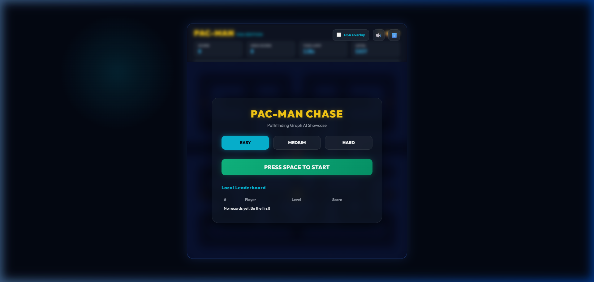
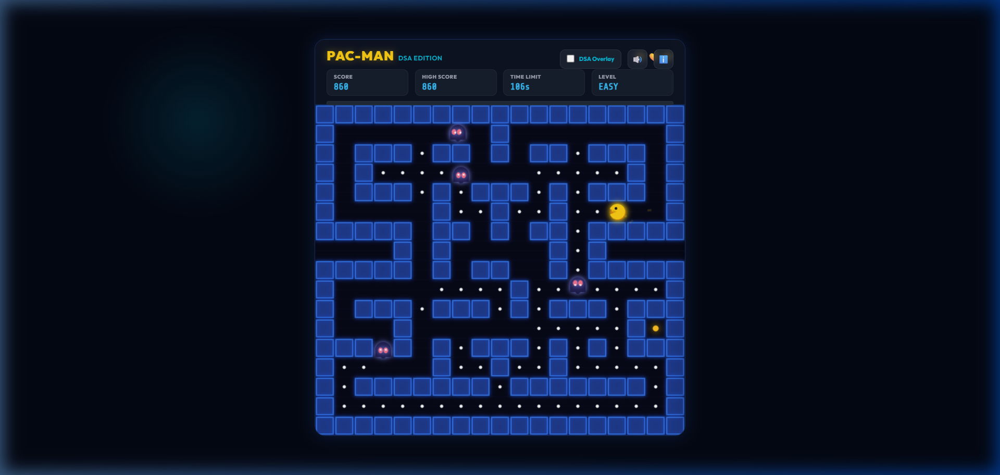
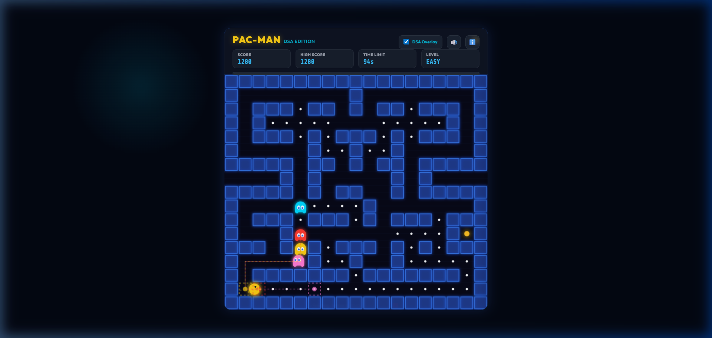

# Pac-Man: Dual-Engine DSA & AI Exhibition

An aesthetic, dual-implementation showcase of classic Pac-Man utilizing Graph Data Structures and Breadth-First Search (BFS) shortest-path pathfinding for ghost AI. This repository contains two standalone implementations:
1. **Python Tkinter Edition**: A desktop-native game built using Python's standard library.
2. **HTML5 Canvas / Vanilla JS Edition**: A web-based application featuring dynamic visualizations of the AI graph, synthesized browser audio, local leaderboards, and custom game analytics.

---

## 🎮 Game Showcase

| Start Menu | Active Gameplay | Graph DSA Overlay |
| :---: | :---: | :---: |
|  |  |  |

---

## 📂 Repository Architecture

```text
├── desktop/
│   ├── pacman.py            # Python Tkinter desktop implementation
│   └── test_pacman.py       # Unit tests validating python levels and graph logic
└── web/
    ├── index.html           # Web interface page mount
    ├── css/
    │   └── styles.css       # Premium styles (dark theme, glassmorphism, side panels)
    ├── screenshots/         # Game showcase screenshots
    │   ├── start_menu.png
    │   ├── gameplay.png
    │   └── dsa_overlay.png
    └── js/                  # JS MVC Architecture
        ├── main.js          # Application bootstrapper
        ├── data/
        │   └── maze.js      # Grid array definition shared by actors
        ├── engine/
        │   ├── game.js      # Central gameloop thread, collision handling, rules
        │   ├── graph.js     # BFS pathfinder and grid-to-graph builder
        │   └── state.js     # Global reactable score, time, levels, performance tracking
        ├── entities/
        │   ├── ghost.js     # Ghost targeting configurations (Blinky, Pinky, Inky, Clyde)
        │   └── pacman.js    # Pac-Man control direction buffer & movement
        └── view/
            ├── audio.js     # On-the-fly oscillator synthesized sound waves
            ├── renderer.js  # HTML5 Canvas visual renderer (draws grid, actors, DSA overlay)
            └── ui.js        # HUD updates, Achievements overlay, Local Leaderboards
```

---

## 🧠 Core Technical Concepts (DSA & AI)

Both game engines are powered by identical core computer science abstractions:

- **Grid-to-Graph Conversion**: Every walkable cell (a cell in the 2D grid matrix that is not a wall `#`) is converted into a vertex (node) in an unweighted undirected graph. Walkable neighbors are linked dynamically.
- **Breadth-First Search (BFS) Pathfinding**: When in Chase mode, ghosts compute their next move using BFS. BFS traverses the graph level-by-level using a **Queue** (`collections.deque` in Python, a flat Array in JS). This ensures they find the absolute shortest path to their target coordinate.
- **Ghost Personalities**:
  - 🔴 **Blinky (Red)**: Pathfinds directly to Pac-Man's exact coordinate.
  - 💗 **Pinky (Pink)**: Intercepts by targeting 4 cells ahead of Pac-Man's current direction.
  - 🌐 **Inky (Cyan)**: Calculates a flanking vector based on Blinky's relative position to Pac-Man.
  - 🍊 **Clyde (Orange)**: Chases Pac-Man using BFS if more than 8 tiles away; otherwise, retreats to his scatter target in the bottom-left corner.

---

## 🐍 Python Tkinter Desktop Edition

A desktop-native application utilizing Python's built-in `tkinter` graphics wrapper. It runs entirely on the standard library with no external dependencies required.

### How to Run

1. Open a terminal/PowerShell in this directory.
2. Launch the script using Python:
   ```powershell
   python desktop/pacman.py
   ```
   *(If `python` is not recognized, try `py desktop/pacman.py`)*

### Controls & Navigation
- **Arrow Keys** or **WASD**: Move Pac-Man.
- **`1` / `2` / `3`**: Switch level difficulty (Easy, Medium, Hard).
- **`Space`**: Start the game (after choosing a level).
- **`R`**: Restart current game state.

---

## 🌐 HTML5 Canvas & JavaScript Web Edition

A modern, highly polished web application featuring glassmorphic menus, micro-animations, audio effects, and educational AI overlays.

### Running a Local Server (Required)
Modern web browsers enforce CORS (Cross-Origin Resource Sharing) security policies which block ES Modules (`type="module"` imports) when files are loaded directly via the `file://` protocol. Consequently, **you must host the directory on a local HTTP server** to play.

Here are the easiest methods:

#### Method A: Python HTTP Server (Recommended)
Since Python is already installed, launch a lightweight web server in your terminal:
```powershell
python -m http.server 8000
```
Then open [http://localhost:8000](http://localhost:8000) in your web browser.

#### Method B: Node.js http-server
If Node.js is installed, you can launch a temporary server instantly:
```powershell
npx http-server .
```
Then navigate to the URL printed in the terminal (usually `http://127.0.0.1:8080`).

### Interactive Features

1. **DSA Graph Overlay**: Check the **DSA Overlay** checkbox at the top-right of the screen to render the underlying graph vertices (nodes) and see lines representing the real-time path sequences calculated by the ghosts.
2. **Local Leaderboard**: Saves high scores, player names, and difficulty selections directly to the browser's `localStorage` across page reloads.
3. **Sound Wave Synthesizer**: Utilizes the browser's native **Web Audio API** to synthesize retro chiptune sounds (siren hums, eating bites, pellet power-ups, ghost deaths) programmatically on-the-fly without needing large audio assets.
4. **Performance Metrics**: View post-game statistics, including **Key Stroke Efficiency** (how accurately your inputs triggered valid movements) and unlocked **Achievements**.

---

## 🧪 Testing

To run the suite of automated tests verifying the Python graph model, layout constraints, and level parameters, execute:
```powershell
python -m unittest desktop/test_pacman.py
```
